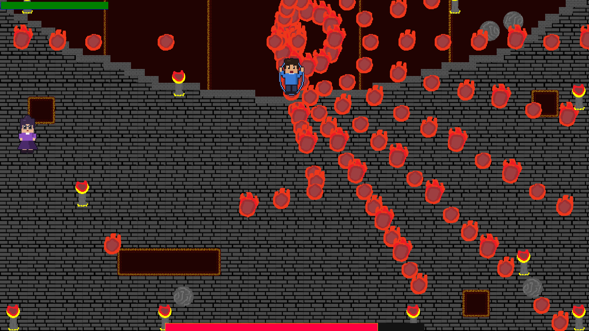
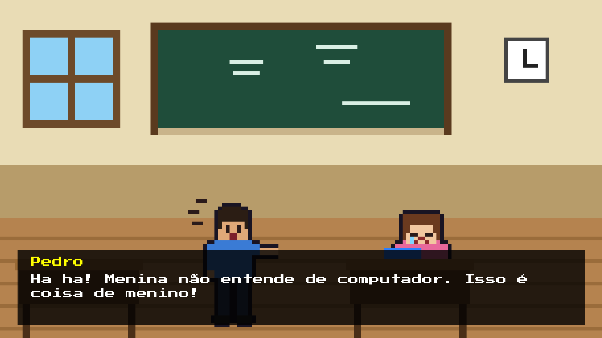
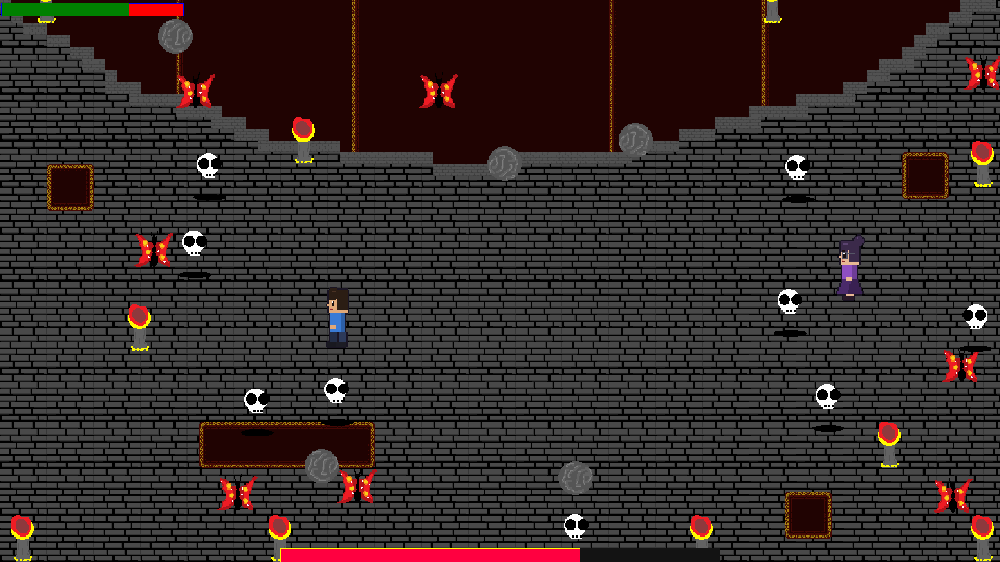
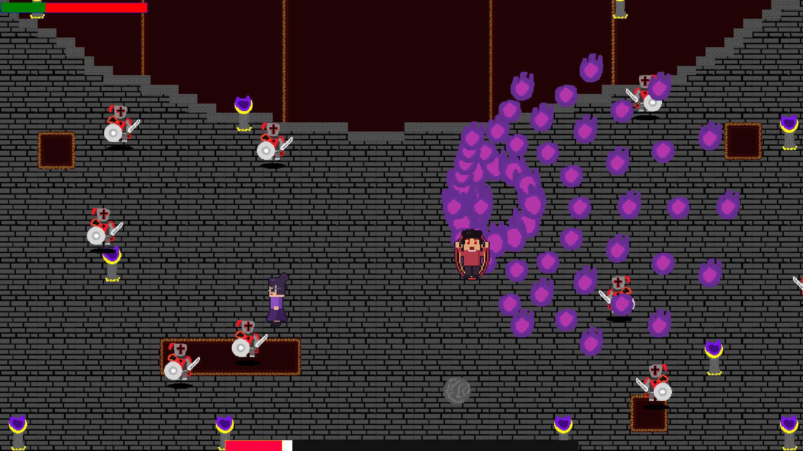
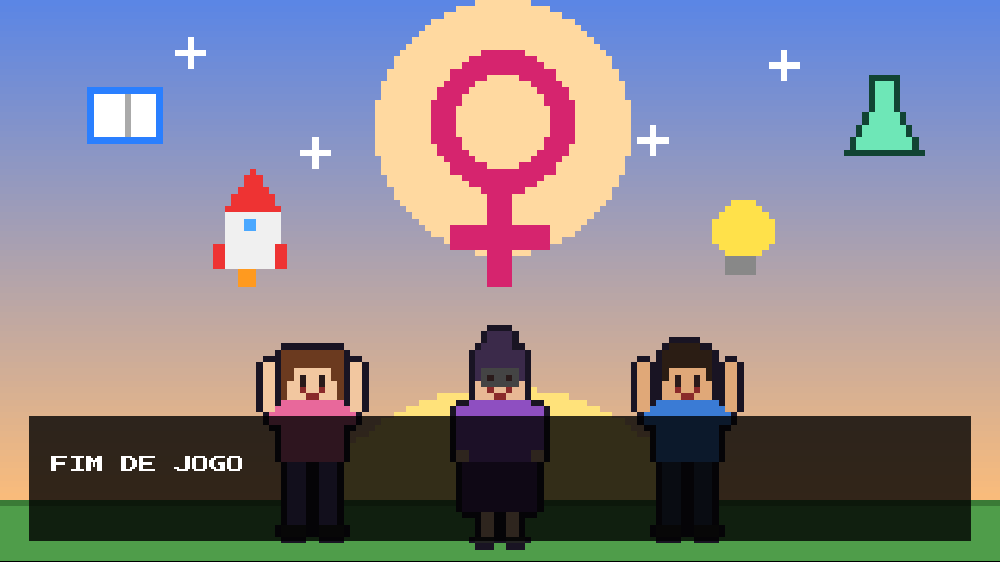

# 🎮 Woman Importance

> Um jogo de ação *top-down* feito em **GameMaker** sobre respeito e igualdade de gênero. Uma professora enfrenta, com lápis como munição, um aluno que acredita que "computador é coisa de menino".




---

## 📖 Sobre o jogo

Na sala de aula, **Pedro** debocha de **Ana** por ela querer participar da aula de computação. A **Prof. Clara** intervém, lembrando que mulheres foram cientistas, líderes e heroínas, e decide dar uma lição ao aluno.

O jogo mistura narrativa em *cutscenes* com uma **batalha de chefe em três fases**. Ao vencer, Pedro reconhece o erro, pede desculpas e a mensagem final fecha a história:

> *Respeitar as mulheres é construir um mundo melhor para todos.*

---

## 📸 Capturas de tela

| | |
|---|---|
| <br>**Cutscene inicial:** Pedro debocha de Ana na sala de aula | <br>**Fase inicial:** rajadas circulares de projéteis do chefe |
| <br>**Mobs:** caveiras e borboletas surgem com HP ≤ 75% | <br>**Fase final:** cavaleiros perseguem a jogadora e o chefe fica mais agressivo |
| <br>**Fim de jogo:** a mensagem final de respeito e igualdade | |

---

## 🕹️ Controles

| Tecla / ação | Função |
|---|---|
| `W` `A` `S` `D` | Mover a Prof. Clara |
| `Espaço` | Atirar lápis (na direção do mouse) |
| `Mouse` | Mirar |
| `Enter` | Iniciar o jogo (menu) / reiniciar após morrer |
| `Espaço`, `Enter` ou clique | Avançar os diálogos das cutscenes |
| `F` / `G` | Ativar / desativar tela cheia |
| `Backspace` | Voltar ao menu |

---

## ⚔️ Mecânicas

### Jogadora (Prof. Clara)
- **100 HP**, com regeneração de 5 HP a cada 5 segundos.
- Atira lápis na direção do mouse (**20 de dano** por acerto).
- Após receber dano de inimigos, fica invulnerável por 1 segundo.
- Limitada à área da arena, com tochas nas bordas funcionando como obstáculos.

### Chefe (Pedro)
O chefe tem **1000 HP** e dispara rajadas circulares de projéteis. A luta muda conforme a vida dele diminui:

| Fase | Gatilho | O que acontece |
|---|---|---|
| **1** | Início | Rajadas de projéteis em círculo enquanto o chefe patrulha a arena |
| **2** | HP ≤ 75% | Chefe pausa os ataques e reaparece no centro; surgem **mobs** que perseguem a jogadora e **borboletas** |
| **2b** | HP ≤ 50% | As borboletas somem e entram **serras** quicando pela arena |
| **3** | HP ≤ 25% | As serras somem e entram **cavaleiros** perseguidores; o chefe ganha novo visual e volta a atirar |

### Perigos da arena
| Perigo | Dano à jogadora |
|---|---|
| Projétil do chefe | 10 |
| Mob | 5 |
| Borboleta | 5 |
| Serra | 10 |
| Cavaleiro | 10 |
| Bloco caindo | 10 |

Derrotar o chefe leva à cutscene final; zerar o HP leva à tela **"VOCÊ MORREU"**, onde `Enter` reinicia a luta.

---

## 🧭 Fluxo do jogo

```
Menu ──Enter──▶ Cutscene de introdução ──▶ Arena do chefe ──┬─▶ Cutscene final ──▶ Menu
                                                              └─▶ Tela de morte ──Enter──▶ Arena do chefe
```

---

## 🛠️ Tecnologias

- **[GameMaker](https://gamemaker.io/)** (projeto criado na IDE `2024.14.4`)
- **GML** (GameMaker Language)
- Sprites e tilesets em pixel art
- Resolução de janela de 1280×720, rodando a 60 FPS

---

## 🚀 Como executar

### Pré-requisitos
- [GameMaker](https://gamemaker.io/en/download) instalado (versão 2024.14 ou superior recomendada)

### Passo a passo
1. Clone o repositório:
   ```bash
   git clone https://github.com/muryllodouglashsoares/gamer-make-project.git
   ```
2. Abra o arquivo **`woman-importance.yyp`** no GameMaker.
3. Pressione **F5** (ou clique em ▶ *Run*) para compilar e jogar.

---

## 📁 Estrutura do projeto

```
├── objects/        # Lógica do jogo (jogador, chefe, inimigos, cutscenes, menu...)
├── rooms/          # Salas: menu, cutscene, arena do chefe, tela de morte
├── scripts/        # Funções auxiliares (cenas/diálogos, balas, approach)
├── sprites/        # Animações dos personagens, projéteis, cenários e cenas
├── tilesets/       # Conjuntos de tiles da arena
├── fonts/          # Fonte dos diálogos
├── options/        # Configurações por plataforma (Windows, Opera GX, Reddit)
├── screenshots/    # Capturas de tela usadas neste README
└── woman-importance.yyp
```

### Principais objetos
| Objeto | Responsabilidade |
|---|---|
| `obj_player` | Movimento, vida, animações e colisões do jogador |
| `obj_arma` / `obj_balaplayer` | Disparo dos lápis e dano causado |
| `obj_boss` | IA do chefe, fases, HUD da barra de vida |
| `obj_mob`, `obj_cavaleiro` | Inimigos que perseguem o jogador |
| `obj_borboleta`, `obj_serras` | Inimigos que se movem pela arena |
| `obj_spawner` / `obj_bloco_caindo` | Blocos que caem aleatoriamente do topo |
| `obj_cutscene` | Diálogos com efeito de máquina de escrever |
| `obj_menu` / `obj_morte` | Tela inicial e tela de derrota |

### Scripts
- **`src_cenas`**: define os diálogos (`cenas_intro`, `cenas_final`) e inicia cutscenes com `cena_iniciar`.
- **`src_balas`**: `bala_acertou`, que aplica dano, cria o efeito de impacto e destrói o projétil.
- **`Script1`**: função `approach`, usada na barra de vida do chefe.

---

## ✏️ Personalizando

Quer adicionar ou editar diálogos? Altere as funções em `scripts/src_cenas/src_cenas.gml`:

```gml
{ img: spr_cena_1, quem: "Ana", txt: "Seu texto aqui..." }
```

---

## 🗺️ Ideias futuras

- [ ] Trilha sonora e efeitos sonoros
- [ ] Mais fases e outros chefes
- [ ] Suporte a gamepad
- [ ] Build para outras plataformas

---

## 👤 Autor

Desenvolvido por **Muryllo Douglas**
GitHub: [@muryllodouglashsoares](https://github.com/muryllodouglashsoares)

---

## 📄 Licença

Defina aqui a licença do projeto (por exemplo, MIT) e adicione um arquivo `LICENSE` na raiz do repositório.
